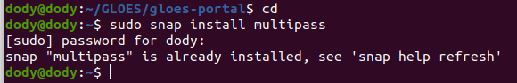
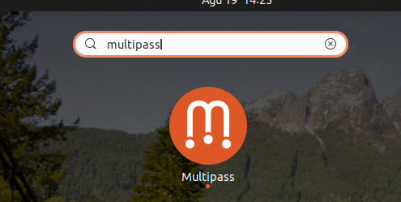
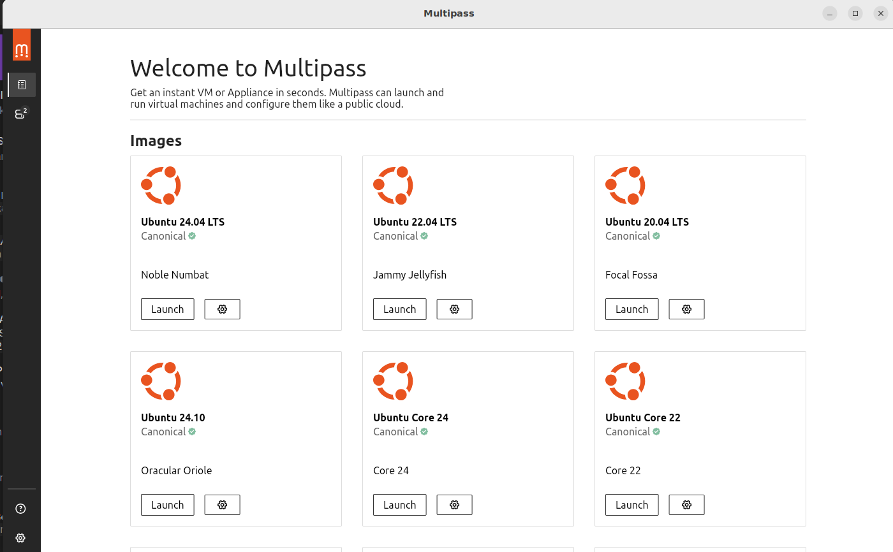
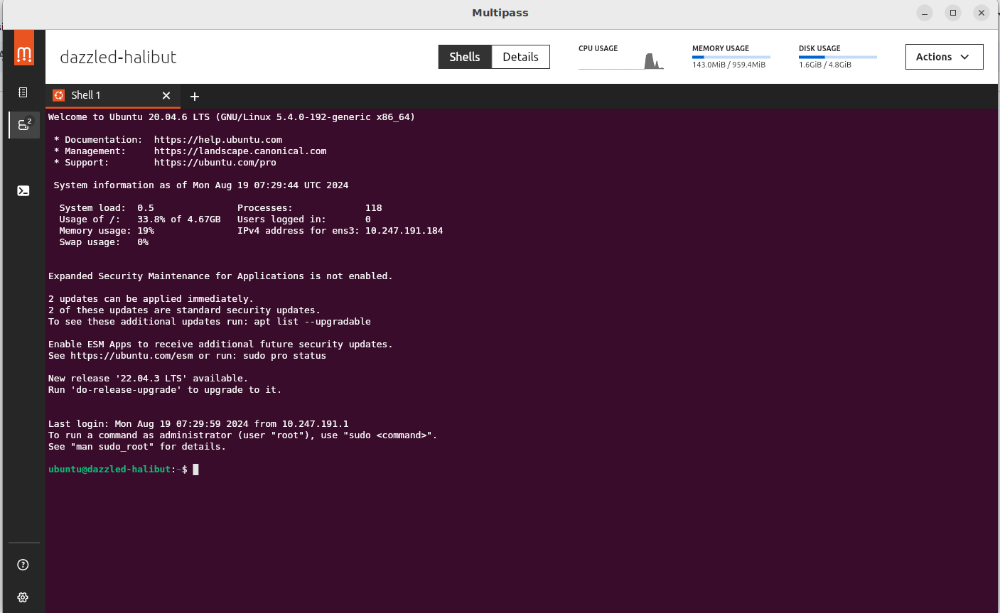
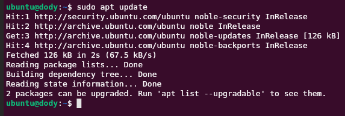
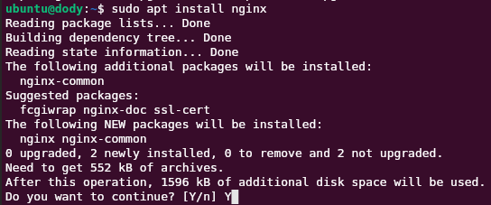
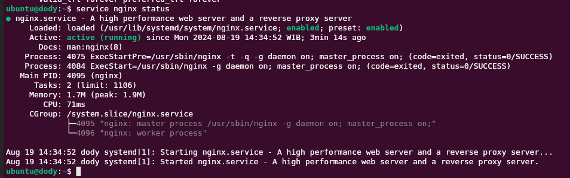
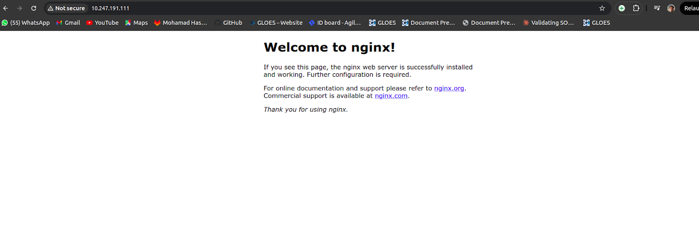

# Task :
1. Menurutmu apa itu DevOps (coba jelaskan dengan bahasa kamu sendiri)
2. Buatlah 1 Virtual Machine (bebas ingin menggunakan Multipass, VMware, Virtualbox, etc)
3. Install Nginx WebServer ke dalam Virtual Machine yang telah kalian buat.

## Apa itu DevOps
DevOps Engineer adalah seorang profesional yang menggabungkan tugas pengembangan perangkat lunak (Development) dengan operasi teknologi informasi (Operations) untuk meningkatkan kemampuan organisasi dalam mengirimkan aplikasi dan layanan dengan cepat dan andal.
DevOps bertugas untuk membuat seluruh proses tersebut menjadi otomatis agar mempercepat proses release ke publik, menurunkan tingkat kegagalan pada rilisan terbaru, serta mempersingkat waktu perbaikan.


## Install Multipass di linux
1. ketikkan command berikut
   
   ```
   sudo snap install multipass
   ```
   
   

2. kemudian multipass akan muncul di menu aplikasi, ketikkan saja
   ```
   multipass
   ```
   
   

3. klik aplikasi itu dan akan muncul tampilan seperti ini

   

4. pilih versi ubuntu yang akan di install kemudian klik “launch” tunggu sampai instalasi selesai, maka tampilan akan berubah seperti ini

   

5. Multipass siap untuk digunakan


## Install NGINX di linux
1. update terlebih dahulu ubuntu kita
   ```
   sudo apt update
   ```
   
   

2. kemudian ketikkan command ini untuk menginstall nginx
   ```
   sudo apt install nginx
   ```
   
   

3. setelah selesai menginstall maka kita cek apakah nginx sudah berjalan atau tidak, dengan menggunakan command berikut 
   ```
   service nginx status
   ```
   
   

4. dapat dilihat bahwa nginx itu sudah loading dan active
 
   

5. kemudian ketik ip address kita untuk melihat apakah nginx sudah bisa di browser


