# TASK
  1. Buatlah Dokumentasi tentang Linux Command yang kamu ketahui!
  2. Jelaskan Perbedaan antara IP Private & Public, serta IP Dynamic & Static!

## Command Linux
1. ls
   perintah untuk menampilkan isi di dalam direktori kita. dapat dilihat bahwa isi dari direktori saya sebagai berikut.
   ```
   ls
     ```
   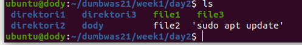

2. mkdir
   mkdir adalah perintah untuk membuat suatu directory, disini saya membuat folder1, folder2, folder3.
   ```
   mkdir folder1 folder2 folder3
     ```
   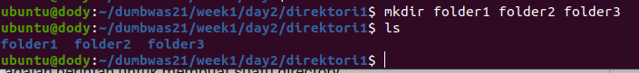

   dapat dilihat bahwa 3 direktori telah tergenerate

3. cd & cd..
   ```
   cd
   ```
   untuk masuk ke direktori yang diinginkan, disini saya ingin masuk ke folder1.

   

   ```
   cd..
   ```
   untuk keluar dari directory sebanyak satu kali. Disini saya keluar dari direktori folder1 menjadi ke direktori1
   
   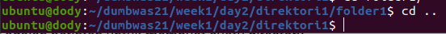

4. touch
   membuat suatu file, disini saya membuat file1, file2, file3. Maka akan tergenerate 3 file.
   ```
   touch
   ```
   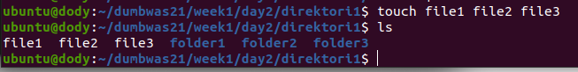
5. cp
   meng-copy file serta mengubahnya dengan nama yang kalian inginkan, disini saya meng-copy file1 dengan nama dody
   ```
   cp file1 dody
   ```
   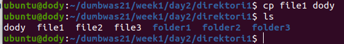

6. mv
   perintah untuk me-rename nama file, tetapi juga dapat digunakan untuk memindahkan suatu file ke directory tertentu. disini saya memindahkan file dody ke dalam direktori2
   ```
   mv dody ../direktori2
   ```
   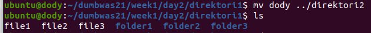

   dapat dilihat bahwa file “dody” sudah ada di direktori2
   
   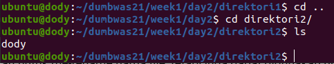
   
7. echo
   menampilkan suatu string atau menyisipkan teks ke dalam file, 
   ```
   echo "dody kiyowo" > file1
   ```
   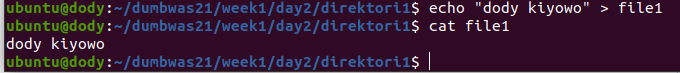

   ##### "noted"
   kalau menggunakan tanda “>” sebanyak 1 kali maka akan mengganti semua isi dari file itu.
   sedangkan kalau menggunakan tanda “>>” sebanyak 2 kali maka akan menambahkan text kedalam file yang dituju.
   contohnya adalah ini.

   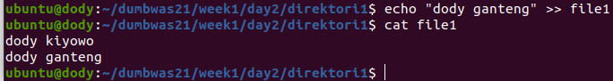

8. cat
   perintah untuk melihat isi dari suatu file, disini saya ingin melihat isi dari file1 .
   ```
   cat file1
   ```
   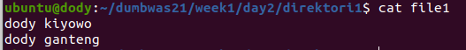

9. ping
   perintah untuk memeriksa koneksi internet. Disini saya menguji koneksi internet ke google.com.
   ```
   ping google.com
   ```
   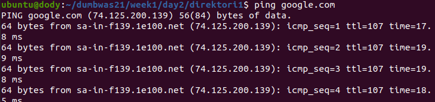

10. wget
    wget adalah perintah untuk mendownload suatu file, sebagai contoh saya ingin mendowload wordpress.
    ```
    wget https://wordpress.org/latest.zip
    ```
    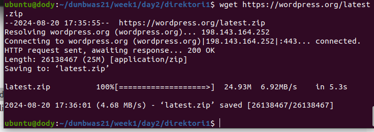

11. history
    melihat riwayat perintah yang sudah kita gunakan sebelumnya
    ```
    history
    ```
    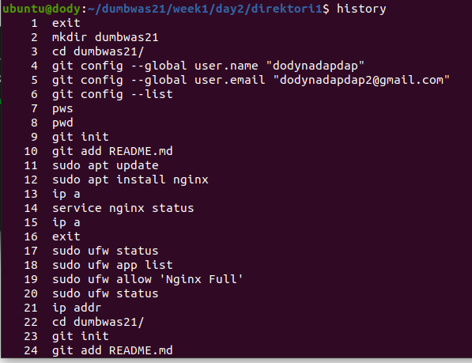

12. find
     mencari suatu file maupun directory. contoh saya ingin mencari file "file1" dan direktori "direktori1"
     ```
     find -type f -name file1
     ```
     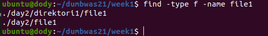
  
    ```
     find -type d -name direktori1
     ```
    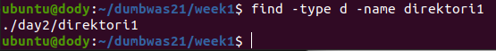

13. grep
    perintah untuk mencari teks di seluruh file, contoh saya disini ingin mencari text “dody”
    ```
    grep -r "dody"
    ```
    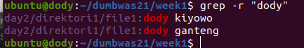

14. rm
    menghapus suatu file ataupun direktori.
    contoh disini saya ingin menghapus file file3
    ```
    rm file3
    ```
    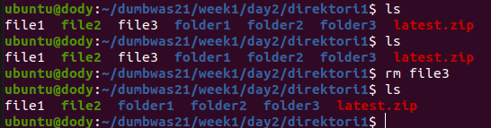

    contoh disini saya ingin menghapus folder3
    ```
    rmdr folder3
    ```
    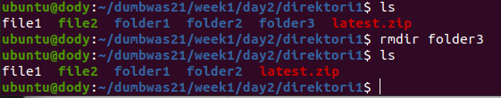

15. adduser
    membuat user baru untuk sistem. contoh saya membuat user "kesya"
    ```
    sudo adduser kessya
    ```
    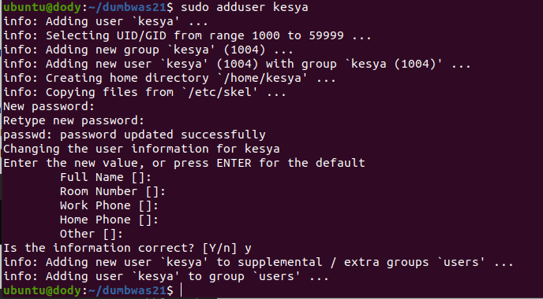

16. chmod
    perintah untuk mengganti permission file maupun directory
    1) r (read)
       tidak bisa melihat
       ```
       chmod -r file1
       ```
       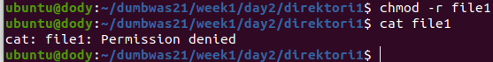

       dapat dilihat bahwa isi dari file1 tidak bisa dilihat.
       mengembalikan agar dapat dilihat menggunakan command ini:
       ```
       chmod +r file1
       ```
       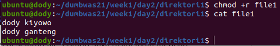

    2) w (write)
       tidak bisa di edit.
       ```
       chmod -w file1
       ```
       
   
       maka akan muncul eror seperti ini

       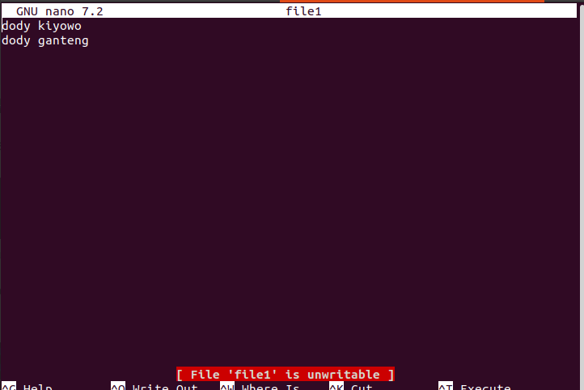
   
       agar dapat diedit isi filenya kembali
       ```
       chmod +w file1
       ```
       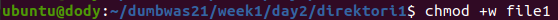
   
       dapat dilihat bahwa sudah tidak ada eror lagi, dan kita dapat bebas menambahkan isi text nya.
    3) x (execution)
       melakukan sebuat aksi untuk melakukan eksekusi program.
       contoh:

       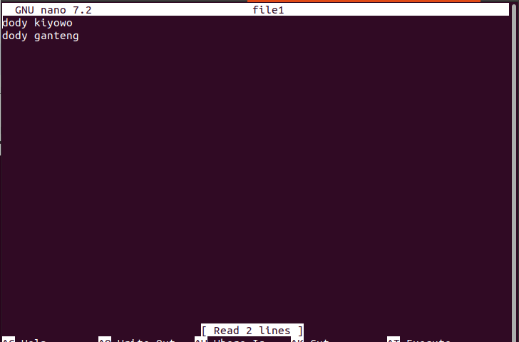

       dapat dilihat pada file2 belum bisa untuk melakukan execution.
       oleh sebab itu kita harus memberi akses untuk melakukan eksekusi “sudo apt update”.
       ```
       chmod +x file2 
       ```
       
   
       dengan begitu ketika kita menjalankan file2 maka akan terjadi sebuah eksekusi program yaitu update linux.

17. chown
    mengganti kepemilikan sebuah directory maupun file. disini saya mengganti kepemilikan file1 tadi yang sebelumnya itu adalah ubuntu menjadi root.
    ```
    sudo chown root:root file1
    ```
    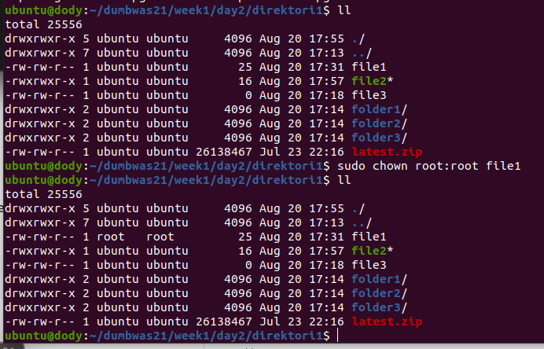
     

   

## Perbedaan antara IP Private & Public, serta IP Dynamic & Static!
