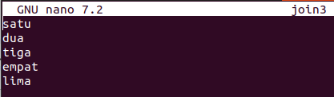

# TASK
1. Buatlah Dokumentasi tentang ShortCut dari Text Editor Nano yang kamu ketahui!
2. Buatlah Dokumentasi tentang Manipulation Text yang kamu ketahui
3. Apa perbedaan Shell Script dan Bash Script ?
4. Buatlah Bash Script untuk melakukan installasi webserver, dengan kebutuhan case: jika user menginputkan nomor 1 maka dia akan melakukan installasi WebServer Nginx dan jika user menginputkan nomor 2 maka akan melakukan installasi WebServer Apache2 
5. Implementasikan Firewall pada linux server kalian. 
    - Buatlah 2 buah Virtual Machine. 
    - Study case nya adalah agar hanya server A yang hanya dapat mengakses WebServer yang ada pada server B.
    - Carilah cara agar UFW dapat memblokir ataupun mengizinkan specific protocol jaringan seperti TCP dan UDP.
    - Jelaskan perbedaan protocol Jaringan TCP serta UDP.
  
##  Dokumentasi tentang ShortCut dari Text Editor Nano
1. Ctrl + A: Pindah ke awal baris
2. Ctrl + E: Pindah ke akhir baris
3. Ctrl + Y: Pindah satu halaman ke atas
4. Ctrl + V: Pindah satu halaman ke bawah
5. Ctrl + _: Pindah ke baris/kolom tertentu (ketik nomor baris,kolom)
6. Ctrl + K: Memotong (cut) baris saat ini
7. Ctrl + U: Tempel (paste) teks yang telah dipotong
8. Alt + 6: Copy baris saat ini
9. Ctrl + J: Meratakan paragraf
10. Alt + U: Undo
11. Alt + E: Redo
12. Ctrl + W: Mencari teks
13. Alt + W: Mengulangi pencarian terakhir
14. Ctrl + \: Mencari dan mengganti teks
15. Ctrl + O: Menyimpan file
16. Ctrl + X: Keluar dari Nano (akan ditanya untuk menyimpan jika ada perubahan)
17. Ctrl + R: Membuka file baru (insert file)
18. Ctrl + G: Menampilkan bantuan
19. Alt + #: Menampilkan/menyembunyikan nomor baris
20. Alt + shift + X: Mengaktifkan/menonaktifkan mode mouse


## Dokumentasi tentang Manipulation Text
 1. sort
    di gunakan untuk mengurutkan isi suatu file
    
    
2. join
   Seperti namanya join berarti gabung. Dengan join kita dapat membandingkan isi dua file. contoh:
   file join1
   
   

   file join2
   
   

   file join3
   
   

   untuk membandingkan dari ketika file ini dapat dilihat  pada gambar berikut:
   
   

3. Cut
   Cut di gunakan untuk print beberapa bagian dari isi sebuah file.
   Contoh:

   

   menampilkan atau memotong 1-5 agar tidak ditampilkan atau di potong

   

4. sed
   sed adalah editor aliran yang memungkinkan manipulasi teks non-interaktif. Editor ini memungkinkan Anda untuk mengubah, mengganti, atau menghapus pola teks dalam file.

   contohnya adalah seperti berikut yang tampilannya begini
   
   

   menjadi seperti ini

   

   **s** berarti kita ingin mengganti sebuah kata,
   **dody** kata yang ingin kita gantikan dan **baris**sadalah kata yang ingin kita gantikan **dody**.
   Huruf **g** dalam perintah tersebut mengindikasikan bahwa kita ingin perintah tersebut dieksekusi secara global, menggantikan setiap contoh kecocokan

## perbedaan Shell Script dan Bash Script
1) Shell sendiri adalah program yang menyediakan command line interface untuk berinteraksi dengan sistem operasi. 
2) Bash script memungkinkan otomatisasi tugas-tugas yang biasanya dilakukan secara manual di command line ini, misalnya, tugas navigasi direktori, membuat file, atau menjalankan program.

## Bash Script untuk melakukan installasi webserver
1. buat file ketik command berikut:

   ```
   nano instalWebServer
   ```

2. kemudian isi script berikut
   

3. Berikan izin eksekusi dengan perintah

  ```
  sudo chmod +x instalWebServer
  ```


4. kemudian jalankan command berikut untuk melakukan eksekusi
  ```
  sudo ./instalWebserver
  ```

  

  
    

##  Implementasikan Firewall pada linux server
1. buat 2 vm
    ```
    multipass launch server-a & server-b
    ```
2. pada server-b
    mengkonfigurasi UFW di server-b untuk hanya mengizinkan akses dari server-a
    ```
    sudo ufw enable
    ```

    ```
    sudo ufw default deny incoming
    ```
    
    ```
    sudo ufw default allow outgoing
    ```

    Untuk mengizinkan akses hanya dari server-a, kita perlu tahu IP address server-a dan catat ip server-a:
    ```
    sudo ufw allow from 10.247.191.8 to any port 80 proto tcp
    ```
    
    ```
    sudo ufw status
    ```
3. Mengizinkan atau memblokir protokol spesifik (TCP/UDP) dengan UFW:
    - Mengizinkan TCP pada port tertentu:
      ```
      sudo ufw allow 80/tcp
      ```
    - Memblokir UDP pada port tertentu:

      ```
      sudo ufw deny 53/udp
      ```
    - Mengizinkan semua TCP connections:

      ```
      sudo ufw allow proto tcp from any to any
      ```

    - Memblokir semua UDP connections:

      ```
      sudo ufw deny proto udp from any to any
      ```

4. Verifikasi konfigurasi:
    curl http:

    
    

    
