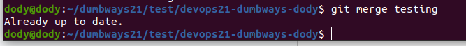
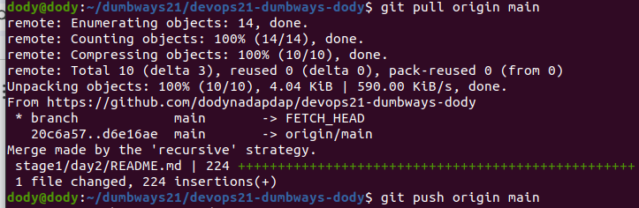

# Task
1. Menurutmu apa itu Git ?
   Git adalah alat software development yang berfungsi sebagai sistem kontrol versi (version control system) untuk menyimpan, mengelola, dan berbagi kode sumber (source code) secara efisien dan kolaboratif.

2. Gambarkan menurut kalian flow dari cara kerja Git ini seperti apa?

    
   
   - Working Directory: Ini adalah direktori di komputer lokal Anda di mana Anda bekerja pada file proyek.
   - Staging Area: Setelah Anda membuat perubahan, Anda dapat memilih perubahan mana yang ingin Anda commit menggunakan git add. Ini memindahkan perubahan ke staging area.
   - Local Repository: Setelah Anda puas dengan perubahan di staging area, Anda melakukan git commit untuk menyimpan perubahan tersebut ke repositori lokal.
   - Remote Repository: Ini adalah versi proyek yang disimpan di server (misalnya GitHub, GitLab). Anda dapat mengirim perubahan ke sini dengan git push dan mengambil perubahan dengan git pull.
   - Remote Tracking Branches: Ini adalah referensi lokal ke state dari branches di remote repository.
   - Other Developers: Menunjukkan bahwa pengembang lain juga dapat push dan pull dari remote repository
   
     flow ini memungkinkan pengembangan yang terdistribusi dan kolaboratif, dengan kemampuan untuk melacak perubahan, bekerja pada fitur secara terpisah, dan menggabungkan pekerjaan dari berbagai sumber.

3. Buatlah Dokumentasi tentang Command yang ada di Git (boleh di tambahkan beberapa command yang mungkin belum kita pelajari pada saat pembahasan di kelas)
    1) ```
       git init
       ```

       Inisialisasi repositori Git baru di direktori saat ini.

    2) ```
       git clone
       ```

       Mengunduh repositori beserta seluruh history-nya.

       
    
    3) ```
       git add
       ```

       Menambahkan file ke area staging.
       
    4) ```
       git commit -m "<message>"
       ```

       Membuat commit dengan pesan yang diberikan.

       
    
    5) ```
        git status
       ```

       Menampilkan status working directory

       
       
    6) ```
       git log
       ```
  
      Menampilkan history commit.

      

    7) ```
       git branch
       ```

       Menampilkan daftar branch lokal.

      
   
    8) ```
       git branch <branch-name>
       ```

       Membuat branch baru.

      


    9) ```
        git checkout <branch-name>
        ```

        Beralih ke branch tertentu.

        

    10) ```
        git merge <branch-name>
        ```

        Menggabungkan branch tertentu ke branch saat ini.

        


    12) ```
        git branch -d <branch-name>
        ```
        
        Menghapus branch lokal.

        


    13) ```
        git remote add <name> <url>
        ```

        Menambahkan remote repository.

        

    14) ```
        git push <remote> <branch>
        ```

        Mengirim perubahan ke remote repository.

        

    15) ```
        git pull <remote> <branch>
        ```

        Mengambil dan menggabungkan perubahan dari remote repository.

        


    16) ```
        git fetch <remote>
        ```
        Mengambil perubahan dari remote tanpa menggabungkan.


    17) ```
        git diff
        ```

        Menampilkan perubahan yang belum di-stage.

    18) ```
        git show <commit>
        ```

        Menampilkan informasi tentang commit tertentu.

        

    19) ```
        git stash
        ```
        Menyimpan perubahan sementara yang belum di-commit.


        
  
        
   
4. Study Case
 - Ada 2 Developer yang sedang melakukan development aplikasi dari perusahaan A sebut saja Reyhan dan Teguh mereka kebetulan sedang mengerjakan suatu proyek yang sama, dan mereka sedang mengerjakan file yang sama `index.html`. Reyhan membuat perubahan pada file index.html dan melakukan commit: `git add index.html;
git commit -m "fix: Typo on Description"`.  Teguh kebetulan juga membuat perubahan pada index.html dan melakukan commit: `git add index.html ; git commit -m "feat: Header Adjustment"`. Kemudia disini ternyata Reyhan melakukan `push` ke repository. Teguh, yang belum melakukan push, mencoba untuk melakukan push ke repositori. Karena ternyata ada perubahan baru di remote yang belum dimiliki Teguh, Git menolak push Teguh dan memberi tahu bahwa ada konflik. Disini Teguh harus melakukan Fix Conflict tersebut agar perubahan yang di buat oleh Teguh dapat tersimpan ke dalam repositori app tersebut. lalu bagaimana cara menangani case yang dimiliki oleh Teguh?

jawab:
  1) Teguh perlu mengambil perubahan terbaru dari remote repository
     
     ```
     git fetch origin
     ```
     
  2) Selanjutnya, Teguh perlu menggabungkan perubahan dari remote branch ke branch lokalnya:

     ```
     git pull origin main
     ```
     
  3) Pada tahap ini, Git akan mencoba menggabungkan perubahan secara otomatis. Namun, karena ada konflik di file index.html, Git akan menandai konflik tersebut dalam file.

  4) Teguh perlu membuka file index.html dan mencari bagian yang ditandai dengan konflik. Biasanya terlihat seperti ini:
     
     ```
     <<<<<<< HEAD
     // Perubahan Teguh
     =======
     // Perubahan Reyhan
     >>>>>>> commit-hash
     ```

   5) Teguh harus mengedit file ini secara manual, memutuskan bagian mana yang harus dipertahankan atau bagaimana menggabungkan kedua perubahan dengan benar.
      
   6) Setelah menyelesaikan konflik, Teguh perlu menandai file sebagai resolved:

      ```
      git add index.html
      ```

   7) Kemudian, Teguh melakukan commit untuk menyelesaikan proses merge: 
      
      ```
      git commit -m "Merge remote-tracking branch 'origin/main' and resolve conflicts"
      ```
   8 ) Terakhir, Teguh dapat melakukan push ke remote repository: 
      
      ```
      “git push origin main”
      ```
