# Task
1. Jelaskan menurutmu apa perbandingan antara Application Monolith & Application Microservices
2. Deploy Aplikasi dumbflix-frontend (NodeJS)
3. Deploy Golang & Python dengan menampilkan nama masing-masing
4. Implementasikan penggunaan PM2 agar aplikasi kalian dapat berjalan di background

### perbandingan antara Application Monolith & Application Microservices
1. Arsitektur:
   Monolith: Satu aplikasi besar yang mencakup semua fungsi.
   Microservices: Aplikasi terbagi menjadi layanan-layanan kecil yang independen.

2. Pengembangan:
   Monolith: Lebih mudah dikembangkan di awal karena semua komponen berada dalam satu proyek.
   Microservices: Memerlukan perencanaan lebih detail, tapi memungkinkan pengembangan paralel oleh tim terpisah.

3. Deployment:
   Monolith: Seluruh aplikasi harus di-deploy sekaligus.
   Microservices: Setiap layanan dapat di-deploy secara terpisah dan independen.

4. Skalabilitas:
   Monolith: Sulit untuk melakukan scaling parsial, biasanya harus menskalakan seluruh aplikasi.
   Microservices: Memungkinkan scaling individual untuk layanan-layanan tertentu sesuai kebutuhan.

5. Kompleksitas:
   Monolith: Lebih sederhana untuk aplikasi kecil hingga menengah.
   Microservices: Lebih kompleks dalam hal manajemen, komunikasi antar layanan, dan monitoring.

6. Performa:
   Monolith: Dapat memiliki performa lebih baik untuk aplikasi sederhana karena tidak ada overhead komunikasi antar layanan.
   Microservices: Mungkin mengalami latency karena komunikasi antar layanan, tapi bisa dioptimalkan untuk beban tinggi.

7. Teknologi:
   Monolith: Biasanya menggunakan satu stack teknologi.
   Microservices: Memungkinkan penggunaan teknologi yang berbeda untuk setiap layanan.

8. Ketahanan:
   Monolith: Jika ada kegagalan, bisa mempengaruhi seluruh aplikasi.
   Microservices: Kegagalan pada satu layanan tidak selalu mempengaruhi keseluruhan sistem.


### Deploy Aplikasi dumbflix-frontend (NodeJS)
1. clone repo dari github
   ```
   git clone https://github.com/dumbwaysdev/dumbflix-frontend
   ```
   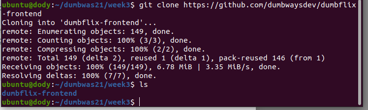

2. masuk ke direkori repo yang sudah di clone
   ```
   cd dumbflix-frontend/
   ```
3. kemudian menginstall npm
   ```
   npm install
   ```
4. kemudian instal nvm versi 16 karena repo dari github menggunakan versi 16
   ```
   nvm install 16
   ```
5. kemudian kita start npm
   ```
   npm start
   ```
   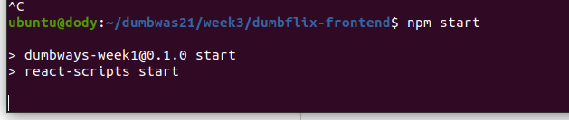


   ini adalah tampilan ketika sudah terdeploy
   
   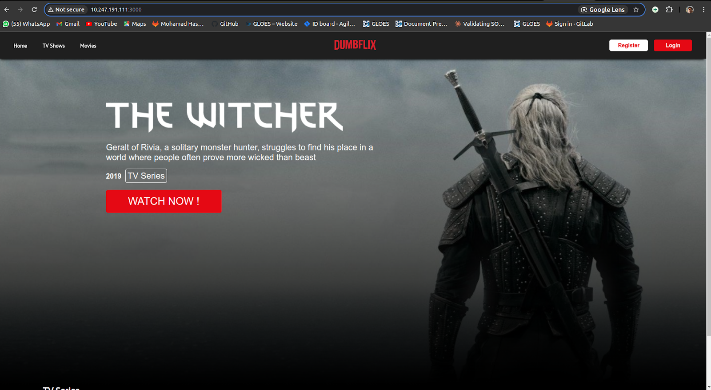


###  Deploy Golang & Python dengan
- Golang
 1. download engine terlebih dahulu\
    ```
    sudo wget https://golang.org/dl/go1.15.5.linux-amd64.tar.gz
    ```
    kemudian extract
    ```
    exec bash
    ```
2. kemudian tambahkan kodingan ini
   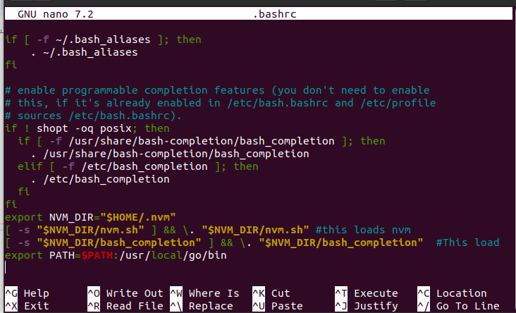

3. buat file golang
   ```
   nano index.go
   ```

4. kemudian tuliskan scrip berikut
   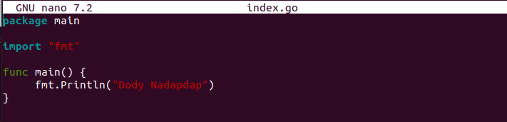

5. kemudian jalankan script golang itu
   ```
   go run index.go
   ```
   output
   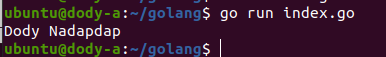


- Python
 1. cek terlebih dahulu python apakah sudah terinstall dan juga pip
     ```
     python3 -V
     ```
     ```
     sudo apt install python3-pip
     ```
  2. install flask, flask yaitu tools untuk menjalankan aplikasi yang akan memberi kita akses untuk menaruh aplikasi kita didalam python yang akan menggunakan sebuah framework
     ```
     pip install flask
     ```
  3. kemudian membuat file python
     ```
     nano index.py
     ```
     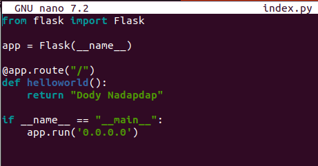
 
  4. jalankan file
     ```
     python3 index.py
     ```
     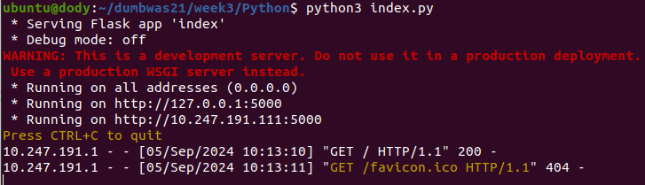
  
  5. kemudian testing di browser
     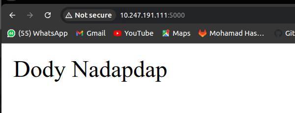


### Implementasikan penggunaan PM2 agar aplikasi kalian dapat berjalan di background
1. instal terlebih dahulu PM2 nya
   ```
   npm install -g pm2
   ```
2. jalankan aplikasi python dengan PM2
   ```
   pm2 start python3 --name "index.py" -- index.py
   ```
   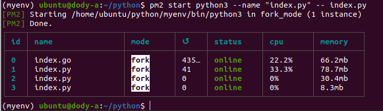

   output
   
   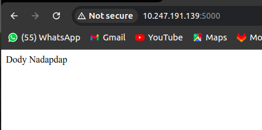
