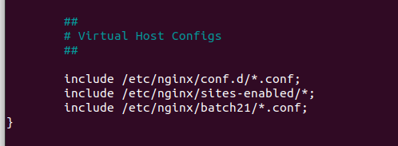

# TASK
1. Jelaskan apa itu Web server dan gambarkan bagaimana cara webserver bekerja.
2. Buatlah Reverse Proxy untuk aplilkasi yang sudah kalian deploy kemarin. ( dumbflix-frontend) dan implementasikan penggunaan pm2 di aplikasi tersebut, untuk domain nya sesuaikan nama masing" ex: alvin.xyz .
3. Jelaskan apa itu load balance.
4. implementasikan loadbalancing kepada aplikasi  dumbflix-frontend yang telah kalian gunakan.


### Web Server
Web server adalah perangkat lunak yang berjalan di komputer server untuk melayani permintaan dari client (biasanya browser web) melalui protokol HTTP. Fungsi utamanya adalah menyimpan, memproses dan mengirimkan halaman web kepada client.
Cara kerja web server secara umum:


1. user mengakses sebuah browser.
2. Jendela browser yang menampilkan "www." untuk merepresentasikan alamat web.
3. browser akan menerima permintaan actor.
4. Ikon database mewakili web server dan penyimpanan data. dan akan menampilkan data yang sesuai dengan data yang di browsing actor,
5. menampilkan data dari actor.


### Buatlah Reverse Proxy 
1. masuk terlebih dahulu kedalam direkoti nginx
   ```
   cd /etc/nginx/
   ```
2. buat konfigurasi baru
   ```
   sudo mkdir batch21
   ```
   ```
   cd bacth21
   ```
   kemudian buat file baru didalam direktori yang sudah dibuatkan
   ```
   sudo nano dody.conf
   ```
   isi sebagai berikut
   
   
   
   kemudian kita tambahkan file konfigurasi yang sudah kita buat kedalam nginx.conf
   ```
   cd ..
   ```
   ```
   vim nginx.conf
   ```
   tambahkan berikut

   

   memeriksa apakah konfigurasi kita sudah benar atau tidak

   

   cek status nginx

   


### load balance
Jelaskan apa itu load balance. Load balancing adalah sebuah solusi yang dapat Anda terapkan untuk menstabilkan server. Load balancing merupakan proses pendistribusian traffic atau lalu lintas jaringan secara efisien ke dalam sekelompok server, atau yang lebih dikenal dengan server pool atau server farm. Load balancing ini berguna agar salah satu server dari website yang mendapatkan banyak lalu linta kunjungan tidak mengalami kelebihan beban. ketika salah satu server mati server yang lain bisa menghandlenya


           


   

        


