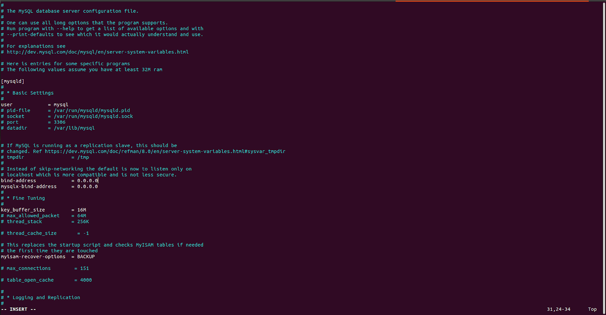
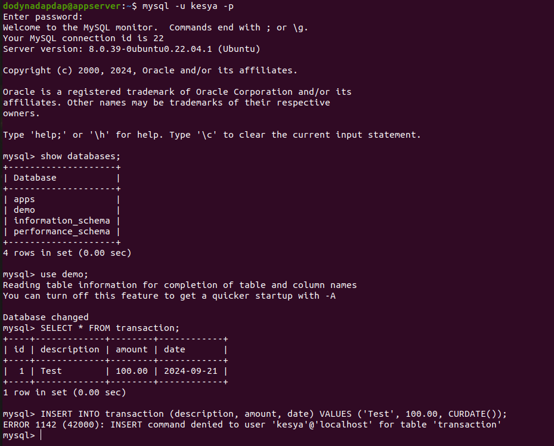

# 0 Server
Tasks :
- Create new user for all of your server
- The server only can login with SSH-KEY without using password at all

1. Connect dulu ke VM nya pakai ssh key yg sudah di daftarkan di biznet gionya atau bisa lewat openconsole supaya bisa langsung masuk ke vm
   ```
   ssh -i dodynadapdap.pem dodynadapdap@103.127.136.49
   ```
2. setelah masuk ke vm nya kita langsung bisa membuat user
   ```
   # command untuk menambah user
    sudo adduser kesya
    
    # command untuk menambahkan sudo (super user do)
    sudo usermod -aG sudo kesya
    
    # command untuk switch user
    sudo su - kesya
   ```
   
   
3. Kemudian unkomen pada configurasi ssh PasswordAuthentication
   
   
   
   

# 1.  Database
Tasks :
- Deploy database MySQL 
	- Setup secure_installation
	- Add password for `root` user
	- Create new user for MySQL 
	- Create new database
	- Create privileges for your new user so they can access the database you created
	- Dont forget to change the MySQL bind address on `/etc/mysql/mysql.conf.d/mysqld.cnf`
- Role Based
	- Create new database call `demo` and make some dummy table call `transaction`
	- Create a 2 role with the name `admin`, and `guest` that will be used to see and manage the 'transaction' table.
	- Give `SELECT`, `INSERT`, `UPDATE`, and `DELETE` access rights to the transaction table for the `admin` role you just created. and only give `SELECT` access to guest.
	- Create a new user with the username `your_name` and password `your_password`. Add the user to the admin role.
	- Create a new user with the username `guest` and password `guest`. Add the user to the guest role.
	- Test all of your user
- Remote User
	- Try to remote your database from your local computer with mysql-client


- Deploy database MySQL
1. Install database mysql nya dulu di terminal linux nya dengan perintah"
   ```
   # update DAN upgrade repository apt supaya security nya terbaru
   sudo apt-get update; sudo apt upgrade

   # install mysql-server
   sudo apt-get install -y mysql-server

   # cek instalation mysql
   sudo mysql --version

   # cek status mysql
   sudo systemctl status mysql.service
   ```

    

2. Agar database kita bisa di akses oleh aplikasi yang berjalan di luar server kita misalnya, kita harus mengubah beberapa konfigurasi yang berada di file /etc/mysql/mysql.conf.d/mysqld.cnf
   ```
    sudo vim /etc/mysql/mysql.conf.d/mysqld.cnf
   ```

   Konfigurasi yang di ubah:
   ```
   bind-address = 0.0.0.0
   mysql-bind-address = 0.0.0.0
   ```
   


3. Setup congifurasi mysql_secure_installation
   ```
   sudo mysql_secure_installation
   ```
   

4. Buat user Mysql
   ganti terlebih dahulu user root yang lama menjadi yang baru dimana user root di hapus dan di create user root baru agar ketika masuk ke database menggunakan password database

   

   CREATE USER dan Database
   
   


- Role Based
1. Membuat database demo

   

   ```
   # Membuat database baru
   CREATE DATABASE demo;

   # Menggunakan database demo
   USE demo;

   # Membuat tabel dummy 'transaction'
	CREATE TABLE transaction (
	    id INT AUTO_INCREMENT PRIMARY KEY,
	    description VARCHAR(255),
	    amount DECIMAL(10, 2),
	    date DATE
	);

   # Membuat peran (role)
   CREATE ROLE 'admin', 'guest';

   # Memberikan hak akses untuk peran admin
   GRANT SELECT, INSERT, UPDATE, DELETE ON demo.transaction TO 'admin';

   # Memberikan hak akses untuk peran guest
   GRANT SELECT ON demo.transaction TO 'guest';

   # Membuat pengguna baru dan menambahkannya ke peran admin
   CREATE USER 'dody'@'localhost' IDENTIFIED BY 'nadapdap123!';
   GRANT 'admin' TO 'dody'@'localhost';

   # Membuat pengguna baru dan menambahkannya ke peran guest
   CREATE USER 'kesya'@'localhost' IDENTIFIED BY 'guest';
   GRANT 'guest' TO 'kesya'@'localhost';

   # Mengaktifkan peran default untuk pengguna
   SET DEFAULT ROLE 'admin' TO 'dody'@'localhost';
   SET DEFAULT ROLE 'guest' TO 'kesya'@'localhost';

   # Flush privileges untuk menerapkan perubahan
   FLUSH PRIVILEGES;
   ```

   Untuk menguji pengguna admin yang telah dibuat:

   

   dapat dilihat bahwa admin bisa melakukan insert data

   Untuk menguji pengguna guest yang telah dibuat:

   

   Perintah SELECT berhasil, tapi INSERT akan gagal.


- Remote User
1. Membuat user dan password

  

   ```
   # Langkah 1: Buat pengguna (jika belum ada)
   CREATE USER IF NOT EXISTS 'dody'@'%' IDENTIFIED BY 'nadapdap123!';

   # Langkah 2: Berikan hak akses
   GRANT ALL PRIVILEGES ON demo.* TO 'dody'@'%';
   
   # Langkah 3: Terapkan perubahan
   FLUSH PRIVILEGES;

   # Periksa hak akses yang diberikan
   SHOW GRANTS FOR 'dody'@'%';
   ```
2. sekarang coba akses menggunakan localhost
   ```
   mysql -h 103.196.153.76 -u dody -p
   ```
  


   itu berarti Anda telah berhasil mengkonfigurasi akses remote ke database MySQL 

   


# 2. Deploy Beckend
- Deploy Wayshub-Backend 
	- Clone wayshub backend application
	- Use Node Version 14
	- Dont forget to change configuration on `dumbflix-backend/config/config.json` and then adjust it to your database.
	- Install sequelize-cli 
	- Running migration
	- Deploy apllication on Top PM2

1. Clone terlebih dahulu Wayshub-Backend
    ```
    git clone https://github.com/dumbwaysdev/dumbflix-backend.git
    ```
     

    kemudian kita instal libarry pada aplikasi beckend kita
    ```
     npm i
   ```
    selanjutnya Copy .env.example to .env
    
    
    
    masuk ke configurasi config.json dan ubah konfigurasi development menjadi username, password, datatabse, dan host database sendiri

    

    Kemudian kita melakukan deploye

   

2. Instal sequelize
   ```
   npm i sequelize-cli -g
   ```
   

3. Setup dabatabase
   pertama buat atau aktifkan ssh terlebih dahulu pada aplikasi beckend dan database
   
   

   kemudian test ping ke vm database dan lakukan migration data
   
   

4. Deploye menggunakan pm2
   
   
   
   sekarang beckend terlah terdeploye secara beacground

   
   

# 3. Deploy Frontend   
Tasks :
	- Clone wayshub frontendapplication
	- Use Node Version 14
	- Dont forget to change configuration on `src/config/api.js` and then adjust it to backend url.
	- Deploy  frontend apllication on Top PM2

Siapkan dulu semua tools yang di butuhkan untuk menjalankan aplikasi, yaitu repo Github, NVM, Node JS, NPM, dan pm2

1. install dulu node version managernya (NVM) setelah selesai lalkukan perintah "exec bash"
   ```
   # command untuk instal NVM
   curl -o- https://raw.githubusercontent.com/nvm-sh/nvm/v0.35.3/install.sh | bash

   # command untuk extract NVM
   exec bash
   ```	
   

2. setelah itu install pm2 dengan NPM supaya kita bisa running di background dan bisa di monitoring juga
   ```
   sudo npm install pm2 -g
   ```

3. Clone repository Dumbflix Frontend

   
   

4. kita bisa buat file ecosystem dari pm2 untuk merunning aplikasinya di background
   
   

5. instal nginx
   ```
   sudo apt update
   sudo apt install nginx
   ```
   kemudian masuk ke direkori nginx

   

6. untuk menguji aplikasi running bisa pergi ke web browser lalu masukan ipaddress:port contoh 103.127.136.49:3000

    

7.  untuk menguji aplikasi running bisa pergi ke web browser yang sudah kita set di nginx lalu masukan alamataddress contoh dody.studentdumbways.my.id

    


# 4. Web Server
Tasks :
- Install nginx
- Buatlah reverse proxy dan gunakan domain dengan nama kalian ex:
  - frontend : randal.studentdumbways.my.id 
     - ssl cloudflare boleh Active / atau ingin menggunakan SSL certbot juga dipersilahkan
  - backend : api.randal.studentdumbways.my.id
     - untuk Installation Certbot ada banyak cara (salah 1 nya seperti pada saat di kelas), atau kalau kalian menemukan cara lain untuk melakukan installation certbot atau tools yang lain yang digunakan untuk melakukan generate ssl feel free to use yaa.
     - Generate SSL untuk reverse proxy kalian. 
     - Sedikit chalange coba cari bagaimana cara pengimplementasian Wildcard SSL 
- Happy Explore :))


