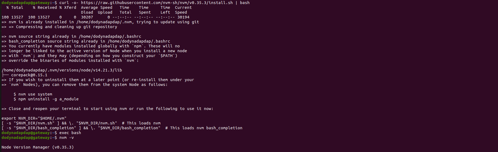

# 0 Server
Tasks :
- Create new user for all of your server
- The server only can login with SSH-KEY without using password at all

1. Connect dulu ke VM nya pakai ssh key yg sudah di daftarkan di biznet gionya atau bisa lewat openconsole supaya bisa langsung masuk ke vm
   ```
   ssh -i dodynadapdap.pem dodynadapdap@103.127.136.49
   ```
2. setelah masuk ke vm nya kita langsung bisa membuat user
   ```
   # command untuk menambah user
    sudo adduser kesya
    
    # command untuk menambahkan sudo (super user do)
    sudo usermod -aG sudo kesya
    
    # command untuk switch user
    sudo su - kesya
   ```
   
   
3. Kemudian unkomen pada configurasi ssh PasswordAuthentication
   
   
   
   
   
# 3. Deploy Frontend   
Tasks :
	- Clone wayshub frontendapplication
	- Use Node Version 14
	- Dont forget to change configuration on `src/config/api.js` and then adjust it to backend url.
	- Deploy  frontend apllication on Top PM2

Siapkan dulu semua tools yang di butuhkan untuk menjalankan aplikasi, yaitu repo Github, NVM, Node JS, NPM, dan pm2

1. install dulu node version managernya (NVM) setelah selesai lalkukan perintah "exec bash"
   ```
   # command untuk instal NVM
   curl -o- https://raw.githubusercontent.com/nvm-sh/nvm/v0.35.3/install.sh | bash

   # command untuk extract NVM
   exec bash
   ```	
   

2. setelah itu install pm2 dengan NPM supaya kita bisa running di background dan bisa di monitoring juga
   ```
   sudo npm install pm2 -g
   ```

3. Clone repository Dumbflix Frontend

   
   
   

4. instal nginx
   ```
   sudo apt update
   sudo apt install nginx
   ```
   kemudian masuk ke direkori nginx

   


