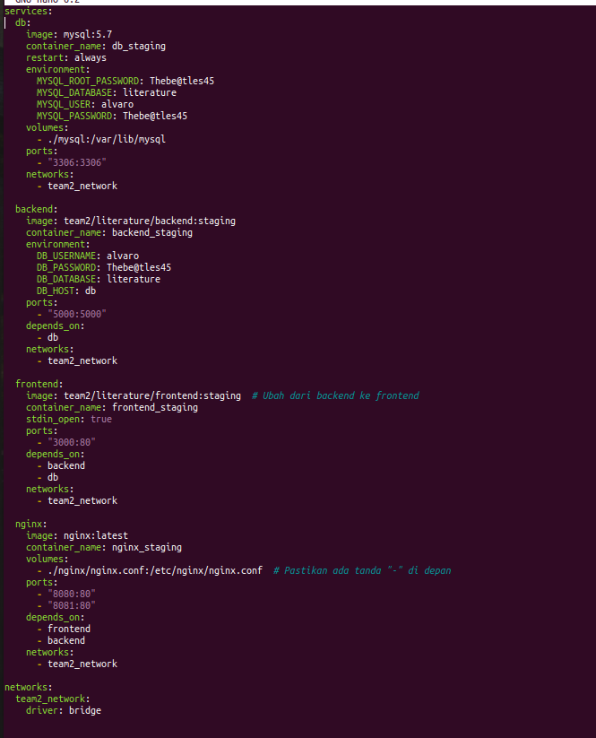
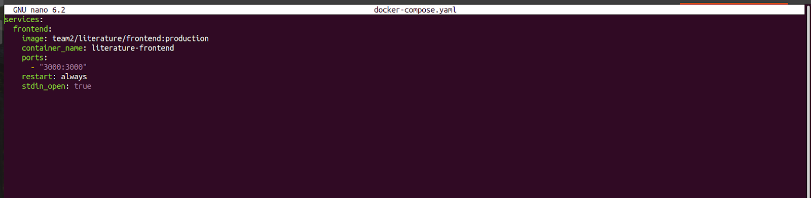
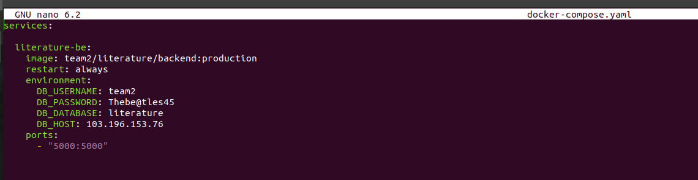
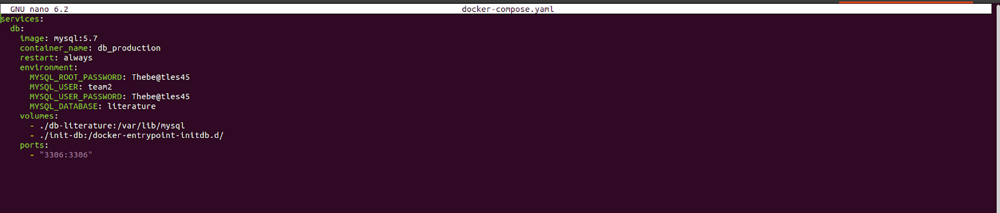
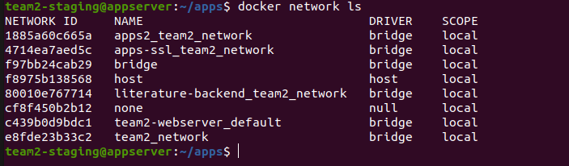
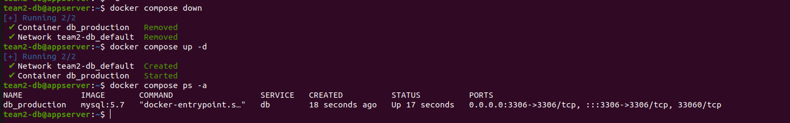

# Docker
Gunakan vm Appserver kalian diskusikan saja ingin menggunakan vm siapa di dalam team

Repository && Reference:
[Literature Backend](https://github.com/dumbwaysdev/literature-backend.git)
[Literature Frontend](https://github.com/dumbwaysdev/literature-frontend.git)
[Certbot](https://certbot.eff.org/instructions?ws=nginx&os=ubuntufocal)
[PM2 Runtime With Docker](https://pm2.keymetrics.io/docs/usage/docker-pm2-nodejs)

Tasks :
[ Docker ]
- Buatlah suatu user baru dengan nama **team kalian**
- Buatlah bash script se freestyle mungkin untuk melakukan installasi docker. 
- Deploy aplikasi Web Server, Frontend, Backend, serta Database on top `docker compose`
  - Ketentuan buatlah 2 environment yaitu (staging dan production)

	- Ketentuan di Staging
	  - Buat suatu docker compose yang berisi beberapa service kalian
    		- Web Server
    		- Frontend
    		- Backend
    		- Database
	  - Untuk penamaan image, sesuaikan dengan environment masing masing, ex: team1/dumbflx/frontend:staging
  	  - Di dalam docker-compose file buat suatu custom network dengan nama **team kalian**, lalu pasang ke setiap service yang kalian miliki.
  	  - Deploy database terlebih dahulu menggunakan mysql dan jangan lupa untuk pasang volume di bagian database.

	- Ketentuan di Production
	  - Deploy database di server terpisah
	  - Server Backend terpisah dengan 2 container di dalamnya
	  - Server Frontend terpisah dengan 2 container di dalamnya
	  - Web Server juga terpisah untuk reverse proxy kalian nantinya.
	  - Untuk penamaan image, sesuaikan dengan environment masing masing, ex: team1/dumbflx/frontend:production

- Untuk building image frontend dan backend sebisa mungkin buat dockerized dengan image sekecil mungkin(gunakan multistage build). dan jangan lupa untuk sesuaikan configuration dari backend ke database maupun frontend ke backend sebelum di build menjadi docker images.

- Untuk Web Server buatlah configurasi reverse-proxy menggunakan nginx on top docker.
    - **SSL CLOUDFLARE OFF!!!**
    - Gunakan docker volume untuk membuat reverse proxy
    - SSL gunakan wildcard
    - Untuk DNS bisa sesuaikan seperti contoh di bawah ini
       - Staging
         - Frontend: team1.staging.studentdumbways.my.id
         - Backend: api.team1.staging.studentdumbways.my.id
       - Production
         - Frontend: team1.studentdumbways.my.id
         - Backend: api.team1.studentdumbways.my.id  
- Push image ke docker registry kalian masing".
- Aplikasi dapat berjalan dengan sesuai seperti melakukan login/register.


### Staging
1. Buat suatu docker compose Web Server, Frontend, Backend, Database
   - Web Server
     Pertama kita membuat file docker composenya terlebih dahulu
     ```
     # membuat direktori untuk letak file docker compose
     mkidr apps

     # membuat file docker compose
     nano docker-compose.yml
     ```
     
     isilah script docker-compose.yml berikut

     


   - Frontend
     ```
     # membuat direktori untuk letak file docker compose frontend
     mkidr literature-frontend

     # membuat file docker compose
     nano docker-compose.yml
     ```

     isilah file docker compose sebagai berikut

     

     ```
     services:
	  frontend:
	    image: team2/literature/frontend:production
	    container_name: literature-frontend
	    ports:
	      - "3000:3000"
	    restart: always
	    stdin_open: true
     ```
     
   - Backend
     ```
     # buat terlebih dahulu repositori beckend
     mkdir literature-backend

     # buat file docker compose
     nano docker-compose.yaml
     ```

     isilah file scriptnya sebagai berikut
    
     

     
   - Database
     ```
     # membuat file docker compose
     nano docker-compose.yml
     ```

     isilah file scriptnya sebagai berikut

     


2. Penamaan Image
   masuk ke server nginx dan edit file configurasi nginx.conf
   ```
   # masuk ke direktori nginx yang dibuat
   cd /apps/nginx/

   # buat file configurasi nginx
   nano nginx.conf
   ```

   isilah file script nginx sebagai berikut

   

3. Di dalam docker-compose file buat suatu custom network dengan nama team
   ```
   # membuat custom network team
   docker network create team2_network 
   ```
   

4. deployee database
   kemudian kita deployee database yang sudah dibuat

   

     
