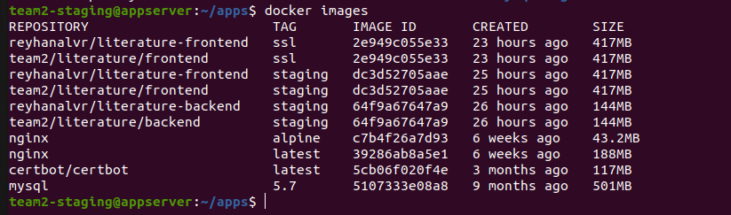

# Docker
Gunakan vm Appserver kalian diskusikan saja ingin menggunakan vm siapa di dalam team

Repository && Reference:
[Literature Backend](https://github.com/dumbwaysdev/literature-backend.git)
[Literature Frontend](https://github.com/dumbwaysdev/literature-frontend.git)
[Certbot](https://certbot.eff.org/instructions?ws=nginx&os=ubuntufocal)
[PM2 Runtime With Docker](https://pm2.keymetrics.io/docs/usage/docker-pm2-nodejs)

Tasks :
[ Docker ]
- Buatlah suatu user baru dengan nama **team kalian**
- Buatlah bash script se freestyle mungkin untuk melakukan installasi docker. 
- Deploy aplikasi Web Server, Frontend, Backend, serta Database on top `docker compose`
  - Ketentuan buatlah 2 environment yaitu (staging dan production)

	- Ketentuan di Staging
	  - Buat suatu docker compose yang berisi beberapa service kalian
    		- Web Server
    		- Frontend
    		- Backend
    		- Database
	  - Untuk penamaan image, sesuaikan dengan environment masing masing, ex: team1/dumbflx/frontend:staging
  	  - Di dalam docker-compose file buat suatu custom network dengan nama **team kalian**, lalu pasang ke setiap service yang kalian miliki.
  	  - Deploy database terlebih dahulu menggunakan mysql dan jangan lupa untuk pasang volume di bagian database.

	- Ketentuan di Production
	  - Deploy database di server terpisah
	  - Server Backend terpisah dengan 2 container di dalamnya
	  - Server Frontend terpisah dengan 2 container di dalamnya
	  - Web Server juga terpisah untuk reverse proxy kalian nantinya.
	  - Untuk penamaan image, sesuaikan dengan environment masing masing, ex: team1/dumbflx/frontend:production

- Untuk building image frontend dan backend sebisa mungkin buat dockerized dengan image sekecil mungkin(gunakan multistage build). dan jangan lupa untuk sesuaikan configuration dari backend ke database maupun frontend ke backend sebelum di build menjadi docker images.

- Untuk Web Server buatlah configurasi reverse-proxy menggunakan nginx on top docker.
    - **SSL CLOUDFLARE OFF!!!**
    - Gunakan docker volume untuk membuat reverse proxy
    - SSL gunakan wildcard
    - Untuk DNS bisa sesuaikan seperti contoh di bawah ini
       - Staging
         - Frontend: team1.staging.studentdumbways.my.id
         - Backend: api.team1.staging.studentdumbways.my.id
       - Production
         - Frontend: team1.studentdumbways.my.id
         - Backend: api.team1.studentdumbways.my.id  
- Push image ke docker registry kalian masing".
- Aplikasi dapat berjalan dengan sesuai seperti melakukan login/register.

### Add User
1. membuat 4 server dan membuat user dengan nama team masing-masing server.
   ```
   sudo adduser <nama user>
   ```
   disini saya membuat 4 server

   

   

2. server name
   - database
  
     

   - backend
  
     

   - frontend
  
     

   - webserver

     

### Install Docker
Buat script file .sh untuk install docker


jalankan ```sudo chmod +x <nama_script.sh>```, untuk membuat file script kita bisa di execute

jalankan script
```
# run script
sudo sh install-docker.sh

# atau
sudo ./install-docker.sh
```

terakhir cek apakah docker kita sudah terinstal atau belum


#### Staging
1. Buat suatu docker compose Web Server, Frontend, Backend, Database
   - Web Server
     Pertama kita membuat file docker composenya terlebih dahulu
     ```
     # membuat direktori untuk letak file docker compose
     mkidr apps

     # membuat file docker compose
     nano docker-compose.yml
     ```
     
     isilah script docker-compose.yml berikut

     


   - Frontend
     ```
     # membuat direktori untuk letak file docker compose frontend
     mkidr literature-frontend

     # membuat file docker compose
     nano docker-compose.yml
     ```

     isilah file docker compose sebagai berikut

     

     ```
     services:
	  frontend:
	    image: team2/literature/frontend:production
	    container_name: literature-frontend
	    ports:
	      - "3000:3000"
	    restart: always
	    stdin_open: true
     ```
     
   - Backend
     ```
     # buat terlebih dahulu repositori beckend
     mkdir literature-backend

     # buat file docker compose
     nano docker-compose.yaml
     ```

     isilah file scriptnya sebagai berikut
    
     

     
   - Database
     ```
     # membuat file docker compose
     nano docker-compose.yml
     ```

     isilah file scriptnya sebagai berikut

     


2. Penamaan Image
   masuk ke server nginx dan edit file configurasi nginx.conf
   ```
   # masuk ke direktori nginx yang dibuat
   cd /apps/nginx/

   # buat file configurasi nginx
   nano nginx.conf
   ```

   isilah file script nginx sebagai berikut

   

3. Di dalam docker-compose file buat suatu custom network dengan nama team
   ```
   # membuat custom network team
   docker network create team2_network 
   ```
   dan cek apakah network yang sudah kita create tadi sudah ada atau tidak
   
   

4. deployee database
     ```
   # matikan terlebih dahulu servernya
   docker compose down
     
   # hidupkan kembali servernya
   docker compose up -d
     
   # cek status dari database yang sudah di deployee
   docker compose ps -a  
   ```
   kemudian kita deployee database yang sudah dibuat

   


#### Production
1. database
   - Buat direktori untuk dijadikan volume
     ```
     mkdir db-literature
     ```

     buat file docker-compose di server database dan membuat volume
     ```
     nano docker-compose.yaml
     ```
     

     Jalankan docker compose.

     ```
     docker compose up -d
     ```

     Check apakah container sudah berjalan dengan sukses
     ```
     docker compose ps -a
     ```
     

     cek untuk mengetahui database yang kita buat tadi berhasil atau tidak

     ```
     # masuk ke container
     docker compose exec db bash
     ```
     


2. backend
   - configurasi file config.json dan isilah sesuai kebutuhan

     
  
   - Di file package.json, saya menambahkan script untuk menjalankan migrate database dengan sequelize-cli
     ```
     "scripts": {
     "start": "nodemon server.js",
     "migrate": "sequelize-cli db:migrate"
     }
     ```
   - Buat Dockerfile untuk build image | Pastikan size image sekecil mungkin dengan multistage build
     
     

   - Build image yang sudah dibuat
     ```
     docker build -t team2/literature/backend:production . 
     ```
     

   - Buat file compose untuk mengkonfigurasi layanan-layanan yang dibutuhkan dalam aplikasi dan menjalankannya dengan satu perintah
    ```
    nano docker-compose.yam
    ```
    kemudian isilah scriptnya sebagai berikut
    ```
    services:

	  literature-be:
	    image: team2/literature/backend:production
	    restart: always
	    environment:
	      DB_USERNAME: team2
	      DB_PASSWORD: Thebe@tles45
	      DB_DATABASE: literature
	      DB_HOST: 103.196.153.76
	    ports:
	      - "5000:5000"
    ```
  - Jalankan script compose dengan perintah dan check apakah sudah berjalan
    ```
     # Command untuk running compose file
     docker compose up -d

     # Command untuk melihat process status dari docker compose
     docker compose ps -a
    ```
   


3. frontend
   - Konfigurasikan Frontend agar bisa terhubung dengan Backend

   


4. Webserver
- Konfigurasi Reverse Proxy Nginx
```
events {
    worker_connections 1024;
}

http {
    server {
        listen 80;
        server_name team2.studentdumbways.my.id;
        return 301 https://$host$request_uri;
    }

    server {
        listen 443 ssl;
        server_name team2.studentdumbways.my.id;

        ssl_certificate /etc/nginx/ssl/fullchain.pem;
        ssl_certificate_key /etc/nginx/ssl/privkey.pem; # Pastikan ini sesuai dengan volume yang di-mount

        location / {
            proxy_pass http://103.127.136.49:3000/;
            proxy_set_header Host $host;
            proxy_set_header X-Real-IP $remote_addr;
            proxy_set_header X-Forwarded-For $proxy_add_x_forwarded_for;
            proxy_set_header X-Forwarded-Proto $scheme;
        }
    }

    server {
        listen 443 ssl;
        server_name api.team2.studentdumbways.my.id;

        ssl_certificate /etc/nginx/ssl/fullchain.pem;  # Pastikan ini sesuai dengan volume yang di-mount
        ssl_certificate_key /etc/nginx/ssl/privkey.pem; # Pastikan ini sesuai dengan volume yang di-mount

        location / {
            proxy_pass http://103.127.136.47:5000/;
            proxy_set_header Host $host;
            proxy_set_header X-Real-IP $remote_addr;
            proxy_set_header X-Forwarded-For $proxy_add_x_forwarded_for;
            proxy_set_header X-Forwarded-Proto $scheme;
        }
    }
}
```
Lakukan Wildcard SSL dengan Certbot
- Sebelumnya saya membuat direktori .secret dan membuat file config.ini dengan isi dns cloudflare api token

Lalu jalankan command ini untuk mendapatkan certificate ssl
```
sudo certbot certonly --dns-cloudflare --dns-cloudflare-credentials ~/.secret/config.ini -d *.team2.studentdumbways.my.id -d team2.studentdumbways.my.id 
```

Buat file docker compose untuk webserver
```
# buat direktori
mkdir nginx

# buat file configurasi
nano docker-compose.yaml
```
isilah scripnya sebagai berikut
```
services:
  nginx:
    image: nginx:alpine
    volumes:
      - ./nginx.conf:/etc/nginx/nginx.conf
      - /etc/letsencrypt/live/team2.studentdumbways.my.id/fullchain.pem:/etc/nginx/ssl/fullchain.pem
      - /etc/letsencrypt/live/team2.studentdumbways.my.id/privkey.pem:/etc/nginx/ssl/privkey.pem
    ports:
      - "80:80"
      - "443:443"
    restart: always
```


Jalankan script compose dengan perintah dan check apakah sudah berjalan
```
# Command untuk running compose file
docker compose up -d

# Command untuk melihat process status dari docker compose
docker compose ps -a
```


### Pembuktian kalau aplikasi kita sudah berjalan


  

     

     


     
     

